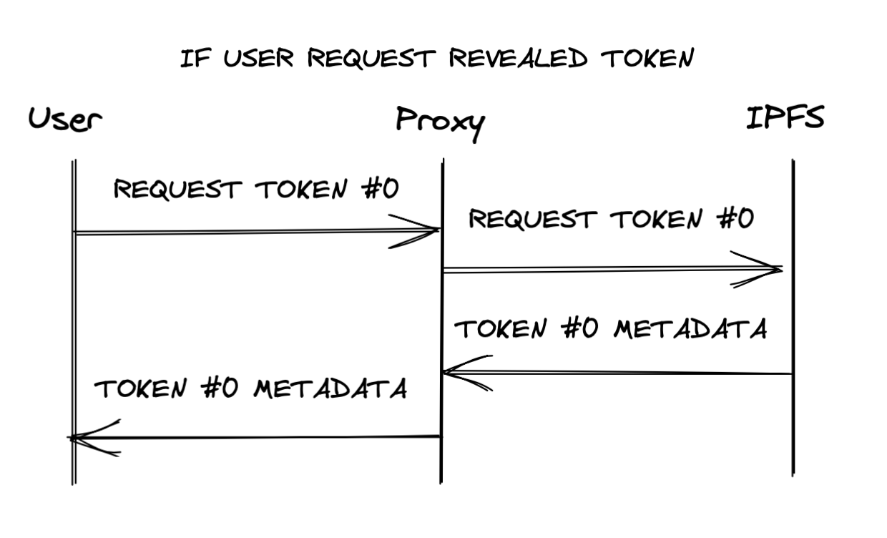
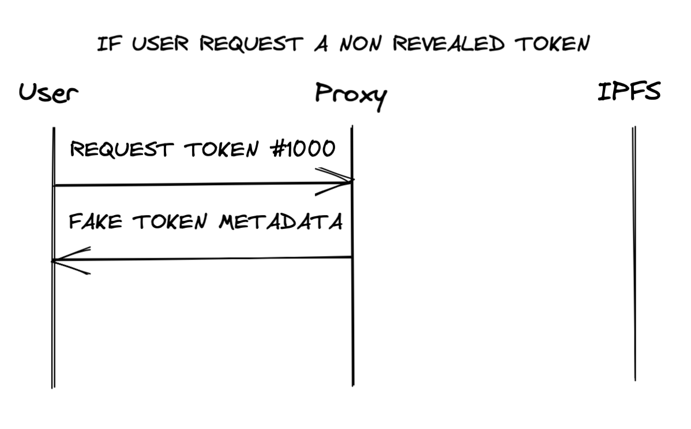

# NFT Sale Proxy

A proxy to hide NFT metadata during the sale and prevent people from sniping specific NFTs.

Usage examples: [alephao/nft-sale-proxy-examples](https://github.com/alephao/nft-sale-proxy-examples)

### What is this?

When dropping a new NFT collection, you don't want the users to be able to know the metadata of a token that were not minted yet, but if you leave the real metadata uri in the contract's `baseURI` then people can just fetch the metadata for all ids, figure out which nfts are rare, and use flashbots to mint the specific rare nft. [This blog post explains how](https://www.paradigm.xyz/2021/10/a-guide-to-designing-effective-nft-launches/).

This repo contains one simple solution for this problem, it's a proxy that returns a fake nft metadata (configured by you) or the real nft metadata (fetches it from somewhere else) depending on your configuration and what the user requested.

For example, if the token metadata is in an IPFS folder, the proxy would fetch the metadata from that IPFS folder and return the result to the user if the token is revealed.

| Revealed Token | Non Revealed Token |
|-|-|
|||

The behaviour is configured by using environment variables, for the example in the images above, the configuration would looks similar to this:

```bash
BASE_URL=https://ipfs.io/ipfs/<METADATA-CID-FOLDER>/
INCOGNITO_IMAGE_URL=<URL_TO_FAKE_LINK>
INCOGNITO_NAME="My Collection #{id}" # Will render as 'My Collection #123' for example
INCOGNITO_DESCRIPTION="A nice collection"
INCOGNITO_EXTERNAL_LINK="https://mycollection.com"
NUMBER_OF_TOKENS=8888
REVEAL_UP_TO=500 # Show real data from ids 0~500 (including 500) and show fake metadata from ids 501+
```

### Getting Started

#### AWS Lambda

To create the proxy using AWS Lambda is very simple, you just need a `go` file with the code below:

```go
package main

import (
  proxy "github.com/alephao/nft-sale-proxy/aws-lambda"
  "github.com/aws/aws-lambda-go/lambda"
)

func main() {
  lambda.Start(proxy.HandleRequest)
}
```

Then you need to make the environment variables listed below available during runtime.

You can see a complete example here: [alephao/nft-sale-proxy-examples](https://github.com/alephao/nft-sale-proxy-examples)

### Configuration

The proxy is configured using environment variables:

| Name | Description |
|-|-|
| `BASE_URL` | The baseURL that contains the actual token metadata |
| `INCOGNITO_IMAGE_URL` | The URL to the image that will show for non-revealed tokens |
| `INCOGNITO_NAME` | The `name` attribute that will show for non-revealed tokens. You can use the placeholder `{id}` and it will be replaced by the token id. |
| `INCOGNITO_DESCRIPTION` | The `description` attribute that will show for non-revealed tokens |
| `INCOGNITO_EXTERNAL_LINK` | The `external_link` attribute that will show for non-revealed tokens |
| `NUMBER_OF_TOKENS` | The maximum amount of tokens. The proxy will return 404 for incoming requests with a number highe than this value |
| `REVEAL_UP_TO` | The highest token id that will be revealed. Start with `-1`, to reveal none. To reveal the first `1000`, change to `999`. Etc. |
| `ERC1155` | Set this to `true` if the token is an ERC1155. This will use 32 bytes hex values padded with `0`s as the id. |